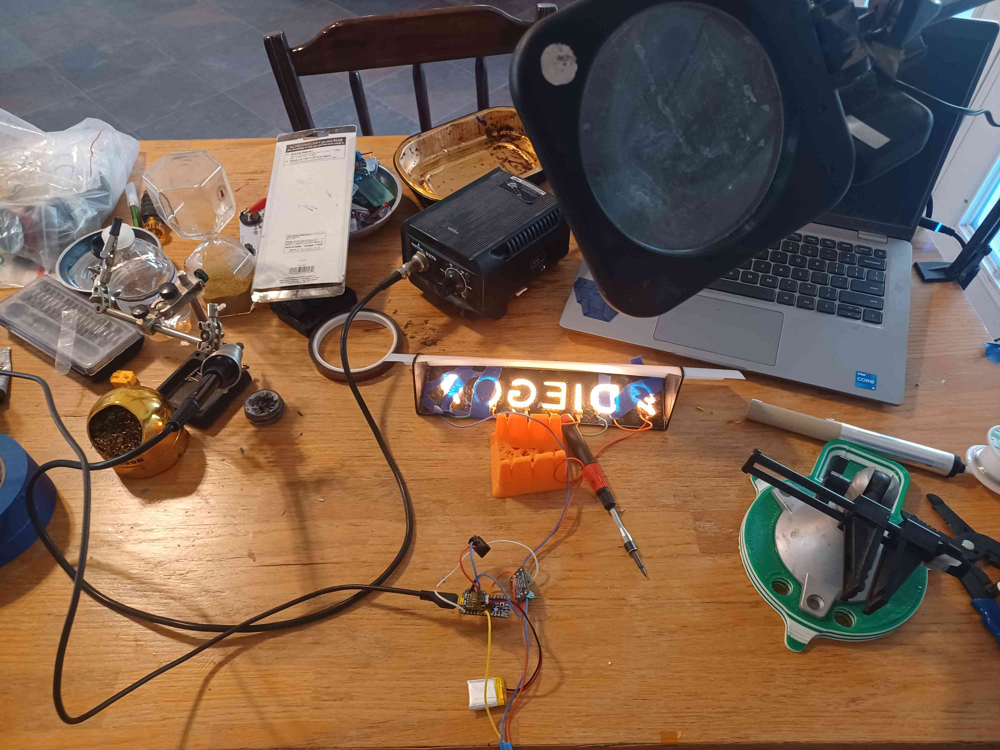

<h3>Adafruit TPS61169 LED Driver - Name Sign</h3>

<h3>Overview</h3>

<helper:RandomGreeting /> &nbsp;This project uses the Adafruit
TPS61169 LED driver to light up a name sign for family member's
graduation gift.

<iframe width="560" height="315"
src="https://www.youtube.com/embed/nRwP4QgfvkM?start=1758"
title="YouTube video player" frameborder="0"
allow="accelerometer; autoplay; clipboard-write; encrypted-media; gyroscope; picture-in-picture; web-share"
referrerpolicy="strict-origin-when-cross-origin" allowfullscreen>
</iframe>

<h3>Design Concepts</h3>

&nbsp;Initially I was just going to power it with a portable
battery pack.  And I got that going.  But then I realized I
wanted the sign  to have some more features.

<ul>
<li>
An on/off switch
</li>

<li>
A way adjust the dimness/brightness
</li>

<li>
Built in battery and recharging
</li>
</ul>

For the new features, I originally prototyped with a Feather
Huzzah.  But then I realized it didn't make sense to use it in
a project that does not use any WiFi features.  Although you
can

<a href="https://github.com/onebeartoe/electronics/blob/master/microcontrollers/src/main/microcontroller/weather-station/feather/huzzah/dht11/displayfull/quad-alphanumeric/weather_station/weather_station.ino" >
turn off the Wifi module</a>

<h3>Order of Operations/Objectives</h3>

<ul>
<li>
Prototype
<ul>
<li>
Get all lights lit
</li>

<li>
Take photos
</li>
</ul>
</li>

<li>
Ask if family member if they wants the lightning bolt
</li>

<li>
Assemble the electronics and enclosure -

Prototype the enclosure around the faceplate and electronics

</li>

<li>
Design enclosure
</li>

<li>
Figure out layout (LED count)

<ul>
<li>
Make images
</li>

<li>
Ask Family Mmembver which they like
</li>

</ul>
</li>
</ul>

<h3>Hardware</h3>

&nbsp;

<ul>
<li>
<a href="https://www.adafruit.com/product/6354" >
LED Driver</a>
</li>

<li>
<a href="https://www.adafruit.com/product/6194" >
Letters</a>
</li>

<li>
<a href="https://www.adafruit.com/product/6096" >
Lightning Bolt</a>
</li>

<li>
<a href="https://www.adafruit.com/product/1152" >
Connector</a> - The product page mentions that these
connector fit the letters, but I only used them to prototype.
The main reasons are that not all letters fit the connector
(some don't have separate connectors ('I') and this connector is not
connected at the JST ends.

I ended up soldering silicone wires directly to the letter
pads, as seen on the 'ADAFRUIT' photo main product
page.

</li>

<li>
<a href="https://www.adafruit.com/product/2010" >
Adafruit Pro Trinket - 3V 12MHz</a>
</li>

<li>
<a href="https://www.adafruit.com/product/2124" >
Pro Trinket and Lipo Backpack</a>
</li>

<li>

</li>

<li>

</li>
</ul>

<h3>Along the Way</h3>

 
 

 
 

 
 

 
 

 
 

 
 

 
 

 
 

 
 

 
 

 
 

<h3>Fritzing Diagram</h3>

&nbsp;Here is a wiring diagram done in Fritzing

<ul>
<li>

</li>
</ul>

Here is a decent-to-nice explanation that Google provided on how
to make the connection between the electronic components used in
this project.

<h3>Faceplate</h3>

&nbsp;The faceplate for this project has cutouts for the letters
in the name 'Diego' and the lightning bolt emoji.

The faceplate idea for this project was inspired by John Park's
show on the TPS61169.  Click the image for the video.

Using OpenSCAD's
text features, I was hoping find the font of the LED letters.  But
alas, I could not find the font.

I did try this prompt in Google AI:

 
<b>
What font is used in iPixel LED Light Co  LED Rigid Bar M0010 ?
</b>
 
But the response was something like: 'if iPixel didn't realease the font,
then you ain't getting no font name, sucka'.

So, no font metrics for me.

I ended up using the letter/lightning bolt PDF datasheets directly in
GIMP to get the SVG path of each letter.  See the link in the
'Resources' section for the datasheets.

Then with the SVG path, I used an Inscape plugin to get a OpenSCAD
code to model the letters in 3D.  The faceplate uses the difference()
module to cutout the individual LED letters. See the 'Resources'
section for a link to the OpenSCAD code.

<ul>
<li>

</li>
</ul>

<h3>Control Panel Side Plate</h3>

&nbsp;The 'control panel' has cutouts for the following items:

<ul>
<li>
Charging Port - This is where the Pro Trinket's USB port is
accessed. See the resources section for the model used for this cutout.
</li>

<li>
Switch

<ul>
<li>
9mm horizontal
</li>

<li>
13mm vertical
</li>
</ul>
</li>

<li>
Potentiometer - 9.5mm x 9.5mm
</li>
</ul>

 

<h3>3rd Party Mounting Hardware</h3>

&nbsp;This project used the following mounting hardware to attach
the driver and microcontroller PCBs to the platform.

<ul>
<li>
<a href="https://www.thingiverse.com/thing:729459" >
jimlee - T-Bracket</a> this one was increased in the Z-axis
to a height of 8mm. I modified this one to be flat, see
the Github link for the STL named 'flat-trinket-mount.stl'.

I also had to chop off part of the USB port area, so that
it would fit into the 'control panel' cutout.  Thank you,
flush cutters!

</li>

<li>
<a href="https://www.adafruit.com/product/6402" >
enclosure for the driver</a>
- This enclosure is available for purchase but for this
project I used the
<a href="https://cdn-shop.adafruit.com/product-files/6402/TPS61169+Enclosure+Files.zip" >
3D printable models</a>
provided by Adafruit on the product page. Only the
bottom part of the model is used in this project.
</li>
</ul>

<h3>Adding a Potentiometer</h3>

&nbsp;I was not sure how to interface the TPS61169's PWM pin with
a microcontroller.  So I placed the following 'prompt' into
Google's  artifical intelligence.

<b>
'tps61169 pwm arduino potentiometer example'
</b>

It gave the
<a href="https://github.com/onebeartoe/electronics/blob/master/leds/drivers/adafruit/tps61169/pro-trinket/pro-trinket.ino" >
Arduino code used in this project</a>
.

It even gave a decent-to-good explanation of the connection details:

TPS61169 PWM Dimming Instructions

To use an Arduino with a potentiometer to control a TPS61169 LED driver, which utilizes PWM for brightness control, the following setup and code can be implemented:
 
<pre>
Circuit Setup:
Potentiometer Connection:
Connect one outer pin of the potentiometer to Arduino's 5V.
Connect the other outer pin of the potentiometer to Arduino's GND.
Connect the middle pin (wiper) of the potentiometer to an analog input pin on the Arduino (e.g., A0).
TPS61169 Connection:
Connect the TPS61169's VIN to your power source (e.g., 5V from Arduino or an external supply).
Connect the TPS61169's GND to the common ground with the Arduino.
Connect the TPS61169's CTRL pin (or EN/DIM pin, depending on the specific breakout board) to an Arduino PWM-capable digital pin (e.g., pin 9 or 10, marked with a ~).
Connect your LED(s) to the appropriate output pins of the TPS61169 according to its datasheet and your LED configuration (e.g., anode to OUT+, cathode to OUT-).
</pre>

<h3>Software - OpenSCAD and Arduino C</h3>

&nbsp;The 3D models for this project were created using
OpenSCAD.  The Pro Trinket is programmed in Arduino C.

<ul>
<li>
<a href="https://github.com/onebeartoe/3D-Modeling/tree/master/openscad/models/src/main/openscad/electronics/led/letters-symbols" >
OpenSCAD</a> - this section of the repository has the
source code for the faceplate and side panels, as well as
the .stl files used for 3D printing.
</li>

<li>
<a href="https://github.com/onebeartoe/electronics/tree/master/leds/drivers/adafruit/tps61169/pro-trinket" >
Arduino C</a>
</li>
</ul>

<h3>Output</h3>

&nbsp;

 
 

 

 
 

<h3>Retrospective</h3>

&nbsp;I would have gone with an all-in-one solution for the
battery charging (no LiPo backpack), like the following
non-WiFi/radio Feathers.

<ul>
<li>
<a href="https://www.adafruit.com/product/4884" >
Adafruit Feather RP2040</a>
</li>

<li>
<a href="https://www.adafruit.com/product/6000" >
Adafruit Feather RP2350 with HSTX Port</a>
</li>
</ul>

But I did not have one handy.

<h3>Going Further</h3>

Going further with this this project, I would like to add somehow
add sound to it&nbsp;

<ploop>

</ploop>

<h3>Resources</h3>

&nbsp;

<ul>
<li>
<a href="https://github.com/adafruit/Adafruit_CAD_Parts/tree/main/2010%20ProTrinket%203V" >
3D model for the Adafruit Pro Trinket 3V</a>
- This was used to make the 'charging port' cutout on the
control panel plate.
</li>

<li>
<a href="https://cdn-shop.adafruit.com/product-files/6210/M0010-A_Z%2825%29.pdf" >
LED Letters Datasheet</a>
</li>

<li>
<a href="https://cdn-shop.adafruit.com/product-files/6096/M0010331LZ-C21532-001_-_A.pdf" >
Lightning Bolt Datasheet</a>
</li>
</ul>

 

